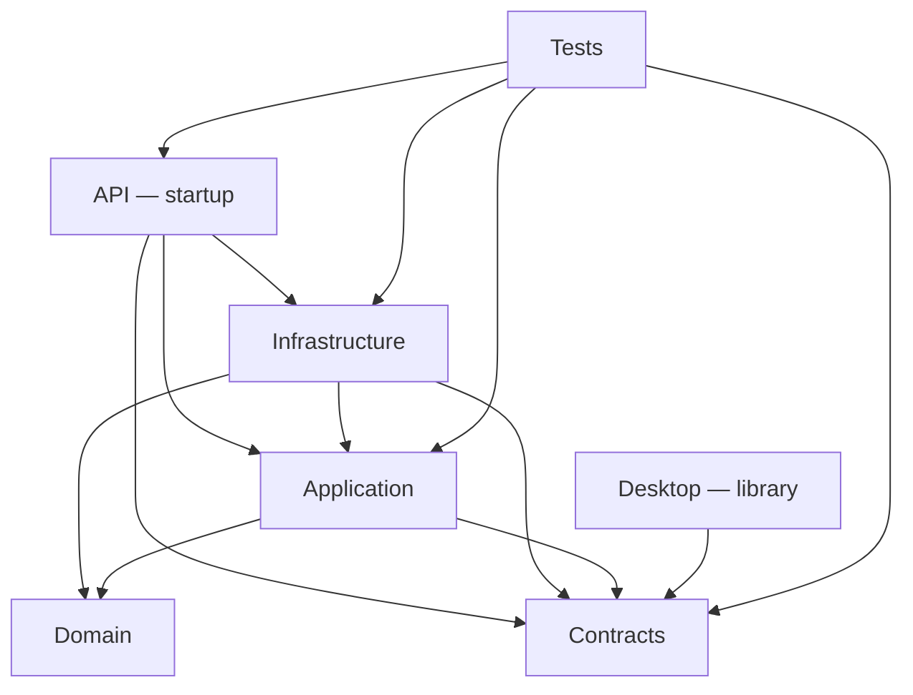

# TEAM-C1 Current Architecture Assessment

**Project:** TransportERP

**Mission:** `MISSION-01_DEEP_AUDIT`

**Role:** TEAM-C1 — Current Architecture Assessment

**Assessment date:** 2026-08-28 UTC

**Status:** COMPLETE — READY FOR CONTROL TOWER REVIEW

**Scope:** current architecture only; no target architecture or refactoring

## Executive determination

The authoritative solution contains **10 projects** in one flat `TransportERP.slnx`. Its only current executable/startup project is **TransportERP.Api**. The active server architecture is concentrated around Waybill foundation, finance, and shipping execution, with EF Core/PostgreSQL persistence, audit, and sync-operation intake. Desktop contains a substantial code-built WinForms screen surface but currently evaluates to a library and has no entry point or service/client wiring. All three Mobile projects are csproj-only libraries with zero source files. Several P1, shared-contract, Geo, attachment, accounting, and voucher components are foundation/prototype surfaces rather than a proven end-to-end runtime.

No circular project reference was found. Proven architectural pressure points are a single broad persistence boundary/DbContext, two large mixed-responsibility classes, duplicate API helper patterns, a parallel in-memory P1 architecture, and presentation/API types placed inside the Persistence namespace. Build, tests, API boot, and live database state are not claimed because no exact-SHA CI exists and the local .NET CLI is unavailable.

## 1. Baseline

| Field | Value |
|---|---|
| Repository | `shfeekalbhure/TransportERP` |
| Authoritative ref | `refs/heads/governance/control-tower-20260828` |
| Authoritative SHA | `8a36f88b56a43cd5b47277b645ba2030ed3da4f1` |
| Tracked remote ref | `origin/governance/control-tower-20260828` at the same SHA |
| Master comparison | `origin/master` at `2ec6cccf42624ec0d0e9aaf2332f5dc2273969a5` |
| Source delta from master | None; four branch-only commits change `CONTROL_TOWER/` governance content |
| Starting worktree | Clean |
| Exact-SHA checks | 0 check runs; 0 Actions workflow runs; no successful status context |
| Local build/test | `NOT RUN` — `dotnet` not installed |
| Live database | `ACCESS BLOCKED — UNKNOWN — REQUIRES VERIFICATION` |

Mandatory sources were read in full: `CONTROL_TOWER/README.md`, all current files under `CONTROL_TOWER/00_GOVERNANCE/`, the full master audit command, and TEAM-C1 `START_ORDER.md`. Product evidence comprised the raw solution/project definitions, all production source inventories and declared types, endpoint/form/migration/test inventories, critical implementations, CI definitions, current history/refs, and a separately labeled unmerged comparison.

The term **current runtime** in this report means reachable by source composition from `TransportERP.Api/Program.cs`; it does not mean successfully built, booted, deployed, or observed in production.

## 2. Project inventory

| # | Project | Type / output | TFM | Function verified from code | Status |
|---:|---|---|---|---|---|
| 1 | `TransportERP.Api` | `Microsoft.NET.Sdk.Web`; executable | `net10.0` | Sole host; JWT validation; DI; sync/audit and Waybill endpoint mapping | Current code-reachable runtime |
| 2 | `TransportERP.Application` | Library | `net10.0` | Waybill application services/ports; P1 in-memory behavioral implementation | Mixed runtime and test/prototype |
| 3 | `TransportERP.Contracts` | Library | `net10.0` | Boundary DTOs/primitives across Core, Waybills, Geo, Party, Numbering, Tracking, Attachments | Mixed active and foundation-only |
| 4 | `TransportERP.Desktop` | Current `Library`; conditional `WinExe` | `net10.0-windows` | Code-built RTL Waybill screens and screen catalog | UI foundation; not executable/wired |
| 5 | `TransportERP.Infrastructure` | Library | `net10.0` | EF/Npgsql entities, mappings, repositories/stores, audit, sync, vouchers, migrations | Runtime dependency plus non-wired foundation |
| 6 | `TransportERP.Mobile.Admin` | Current `Library`; conditional MAUI `Exe` | Current `net10.0` | Project condition only; no source | Empty placeholder |
| 7 | `TransportERP.Mobile.Customer` | Current `Library`; conditional MAUI `Exe` | Current `net10.0` | Project condition only; no source | Empty placeholder |
| 8 | `TransportERP.Mobile.Driver` | Current `Library`; conditional MAUI `Exe` | Current `net10.0` | Project condition only; no source | Empty placeholder |
| 9 | `TransportERP.Tests` | Test library | `net10.0` | xUnit unit/contract/API/persistence/PostgreSQL suites | Tests exist; exact SHA not run |
| 10 | `TransportERP.Domain` | Library | `net10.0` | Waybill aggregate plus financial/shipping rules | Current runtime dependency |

### Startup, libraries, tests, and prototypes

- Startup/executable: **API only**.
- Runtime-supporting libraries: Domain, Application, Contracts, Infrastructure.
- Test project: **one**, `TransportERP.Tests`, containing 22 C# files, 101 `[Fact]`, and 2 `[Theory]` declarations.
- Proven test/prototype-only code: `Application/P1Baseline/P1InMemoryBaseline.cs`, referenced by its behavior tests but not API composition.
- Proven placeholders: the three Mobile projects.
- Desktop is a non-executable UI foundation at this SHA.
- No additional current `.csproj` exists outside the ten solution entries.

## 3. Current Visual Studio solution tree

There is one `.slnx` and no `.sln` or `.slnf`. The file contains ten direct `<Project>` elements and no Solution Folder element, so the current Visual Studio logical tree is flat:

```text
TransportERP.slnx
├── TransportERP.Api
├── TransportERP.Application
├── TransportERP.Contracts
├── TransportERP.Desktop
├── TransportERP.Infrastructure
├── TransportERP.Mobile.Admin
├── TransportERP.Mobile.Customer
├── TransportERP.Mobile.Driver
├── TransportERP.Tests
└── TransportERP.Domain
```

This conclusion comes from the raw `.slnx`, not project or directory names and not a Visual Studio screenshot.

## 4. Current physical repository tree

```text
root
├── .github/workflows
├── CONTROL_TOWER
├── TransportERP/Waybills
├── TransportERP.Api/{Program.cs,Waybills/}
├── TransportERP.Application/{P1Baseline/,Waybills/}
├── TransportERP.Contracts/{Attachments/,Core/,Geo/,Numbering/,Party/,Tracking/,Waybills/}
├── TransportERP.Desktop/{CoreUI/Architecture/,Waybills/}
├── TransportERP.Infrastructure/Persistence/{Migrations/,...}
├── TransportERP.Mobile.Admin/        csproj only
├── TransportERP.Mobile.Customer/     csproj only
├── TransportERP.Mobile.Driver/       csproj only
├── TransportERP.Tests/               flat test-file layout
├── artifacts/
└── documentation/{architecture/,closeout/,design/,recovery/}
```

Production-source counts are Domain 3, API 4, Application 4, Contracts 14, Desktop 5, Infrastructure 39, and Mobile 0+0+0 C# files. Tests contain 22 C# files. The physical hierarchy is therefore substantially richer than the flat solution tree.

## 5. Dependency map

### Exact direct ProjectReferences

| From | To |
|---|---|
| Application | Domain, Contracts |
| Infrastructure | Domain, Application, Contracts |
| API | Application, Contracts, Infrastructure |
| Desktop | Contracts |
| Tests | Application, Contracts, Infrastructure, API |
| Domain, Contracts, all three Mobile projects | None |



Mobile.Admin, Mobile.Customer, and Mobile.Driver are isolated solution nodes. The directed project graph is acyclic. **Circular ProjectReferences: NONE PROVEN.**

### Direct package configuration

- API directly references ASP.NET OpenAPI, Microsoft.OpenApi, JwtBearer, EF Core, and the Npgsql EF provider.
- Infrastructure directly references EF Core, the Npgsql EF provider, Cryptography.Xml, and EF Design.
- Tests directly reference coverlet, EF InMemory, MVC Testing, the .NET test SDK, and xUnit packages.
- Conditional Mobile package references are inactive because their MAUI scaffold conditions are false.
- No central package management, SDK pin, NuGet configuration, or lock file exists.

Resolved transitive packages are `UNKNOWN — REQUIRES VERIFICATION` because restore could not be run.

## 6. Current module/domain placement

| Domain/capability | Actual placement | Evidence-based state |
|---|---|---|
| Waybill foundation | All five server layers plus Desktop | Server route-to-persistence path is composed |
| Waybill finance | Domain rules, Contracts/Application/API/Infrastructure, Desktop forms | Server path composed; Desktop disconnected |
| Shipping execution | Domain rules, Contracts/Application/API/Infrastructure, Desktop forms | Server path composed; Desktop disconnected |
| Numbering | Contracts port, EF implementation, Waybill application use | Active through approval flow |
| Operational parties | Waybill contract/application/repository/API | Search/create route active in composition |
| P1 organization/security/settings/accounting | Infrastructure data model plus Application in-memory prototype | Foundation/data surface, not a complete API/UI module |
| Audit | Infrastructure entity/service, API query endpoint, Waybill audit sink | Runtime-composed |
| Sync | Infrastructure operation/conflict persistence/service, API batch enqueue | Server intake/state persistence only; no current client offline pipeline proved |
| Geo | Contracts | Foundation-only |
| Attachments | Contract descriptor | Foundation-only |
| Generic tracking | Contract envelope; separate shipping movement persistence | Parallel foundation and active shipping-specific representations |
| Reporting | No dedicated production project/service/module | No subsystem proved |
| Ticketing | No production implementation found | Absent in current source |

Shipping/Waybill is the only feature family proved across Domain, Contracts, Application, API, Infrastructure, Desktop, migrations, and tests.

## 7. Screens and UI placement

Desktop has 16 concrete WinForms plus one abstract `ShippingRtlForm`. The screen catalog expresses 19 IDs:

- Foundation: SHP-005, SHP-006, SHP-007, SHP-008, SHP-014.
- Finance: SHP-009, SHP-010, SHP-011, SHP-012.
- Shipping: SHP-015, SHP-016, SHP-019, SHP-023, SHP-024, SHP-025, SHP-027, SHP-028, SHP-029, SHP-030.

The difference between 16 forms and 19 IDs is explained by `WaybillDraftForm`, which represents five tab/catalog screen entries. UI is created in C# with no Designer/resx artifacts.

The forms bind Contract DTOs and emit typed or untyped events. There is no `Program.cs`, application/infrastructure reference, HTTP client, composition root, or in-repository event subscriber. Therefore these screens are **current source assets but not a current executable Desktop runtime**.

There are no current Mobile screens because each Mobile project has zero source files.

## 8. Services / contracts / data / infrastructure placement

### Services and ports

- `Application/Waybills`: `WaybillApplicationService`, `WaybillFinanceApplicationService`, `ShippingExecutionApplicationService` and their repository/store/unit-of-work/audit ports.
- `Infrastructure/Persistence`: EF implementations, audit service, sync-operation service, and voucher lifecycle service.
- `API/Waybills`: endpoint mapping plus DI registration of active Waybill services.
- `VoucherLifecycleService` exists and has persistence tests, but no current API registration/endpoint was found.

### Contracts

- Active cross-boundary Waybill request/response/permission contracts live under `Contracts/Waybills`.
- `Contracts/Core` provides operation context, money/fx, capability, and error primitives.
- Geo, Attachment, generic Party, and generic Tracking contracts have no current end-to-end runtime composition.

### Data and database integration

- One `TransportErpDbContext` spans organization, identity/RBAC, settings, accounting, audit, sync/conflicts, Waybill, finance, and shipping data.
- Public DbSets are primarily P1 types; P2 types are obtained via `Set<T>()`.
- A replacement `TransportErpP2CombinedModelCustomizer` composes the DbContext base model with Waybill foundation, finance, and shipping model builders.
- All migrations reside under `Infrastructure/Persistence/Migrations`: **10 migration classes**, 9 generated designer companions, and one model snapshot.
- The design-time factory reads `TRANSPORTERP_DESIGN_CONNSTR` and otherwise uses a local fallback connection string.
- No live database was examined; schema application and drift remain unknown.

## 9. Shared components and lookups

Proven active shared surfaces are Contracts/Core primitives, active Waybill DTOs/permission codes, and Desktop `TransportScreenProfile`. `ShippingRtlForm` shares RTL/layout behavior among shipping forms only.

Operational-party search is the only current lookup endpoint proved. Geo has DTOs but no current API/repository/screen. No common dialog/picker component was found. The repository contains parallel shared-looking contracts not used in current runtime composition:

- `BusinessAuditEvent` / `IBusinessAuditWriter`, while active audit uses Infrastructure `AuditEventDraft`/`AuditEventService` and `IWaybillAuditSink`.
- `OperationalPartySnapshot`, while active Waybill flow uses `OperationalPartyRecord` and Waybill-specific DTOs.
- `MovementEnvelope`, while shipping runtime persists `MovementEventEntity`.

These are classified as unintegrated current-tree surfaces, not deleted/obsolete components; external use is unknown.

## 10. Architectural problems proved by evidence

| ID | Proven issue | Evidence and boundary |
|---|---|---|
| C1-PROB-001 | Broad persistence boundary | All P1 and P2 entities, mappings, repositories, audit, sync, vouchers, customizers, and migrations occupy one project and primarily one namespace |
| C1-PROB-002 | DbContext responsibility concentration | `TransportErpDbContext.cs` is 400 lines and configures organization, identity/RBAC, settings, accounting, audit/sync, plus P2 model composition |
| C1-PROB-003 | Shipping persistence God Class / mixed responsibility | `EfShippingExecutionStore` is 1,212 lines and combines release, trip, allocation, manifest, load/finalize/handover/start, queries, transaction control, idempotency outcome storage, mapping, audit, and errors |
| C1-PROB-004 | P1 in-memory God Class / mixed responsibility | `P1InMemoryBaseline.cs` is 664 lines; `P1InMemoryService` spans screen state, authentication, organization, RBAC, settings, accounts, periods, journals, vouchers, audit, and sync |
| C1-PROB-005 | Desktop is structurally disconnected | Current output is Library; no entry point; only Contracts reference; request events have no current subscribers/client adapter |
| C1-PROB-006 | Repeated API boundary mechanics | The three Waybill API modules each repeat context/claim parsing, GUID parsing, permission checks, and error execution patterns |
| C1-PROB-007 | HTTP/presentation types misplaced in Persistence | `AuditQueryRequest`, response types, `AuditScope`, error codes, and `AuditEventApi` are declared in `Infrastructure.Persistence`; live mapping/scope logic is separately implemented in API `Program.cs` |
| C1-PROB-008 | Package responsibility overlap | API and Infrastructure both directly own EF Core/Npgsql references while provider behavior is concentrated in Infrastructure |
| C1-PROB-009 | One test assembly spans distinct test architectures | Unit, contract, API-host, EF in-memory, and live-PostgreSQL suites share one project |
| C1-PROB-010 | Solution tree does not express physical/module grouping | `.slnx` is flat despite multiple physical capability areas |
| C1-PROB-011 | No reproducible resolved package baseline in-tree | No SDK pin, central package configuration, or lock file exists; exact resolution could not be verified |
| C1-PROB-012 | Large multi-form source file | `ShippingExecutionForms.cs` is 772 lines and holds one base plus ten concrete forms/catalog responsibilities |

Only source-proved structure is recorded. No quality claim is based merely on a folder name.

## 11. Duplication / coupling / circular dependencies

### Duplication and duplicate responsibilities

- P1 has two responsibility surfaces: the test-used in-memory model/service in Application and EF entities/services in Infrastructure. API composes the EF path, not the in-memory path.
- Active audit types/services differ from the unused shared audit writer contract; API also duplicates audit scoping/response mapping instead of using `AuditEventApi`.
- Generic Party and Tracking contract representations coexist with active Waybill/shipping-specific representations.
- API helper methods and endpoint execution/error patterns are repeated across three modules.
- Basic WinForms grid/row construction is repeated between feature files; shipping has its own local base while foundation/finance forms inherit `Form` directly.

### Tight coupling

- API has concrete knowledge of Infrastructure for host composition.
- All persistent feature families converge on one DbContext and persistence namespace.
- Shipping application operations converge on one very large EF store.
- Desktop is coupled to concrete Contract DTOs/events but has no connecting abstraction or executable shell.

### Circular dependencies

- ProjectReference cycles: **NONE PROVEN**.
- Static namespace/type dependency cycles: **NONE PROVEN**.
- A successful build was not available to add compiler-level confirmation.

## 12. Misplaced or mixed responsibilities

- `AuditEventApi` and HTTP request/response/scope/error types are physically and nominally in `TransportERP.Infrastructure.Persistence`.
- `P1InMemoryBaseline.cs` combines records, enums, store, service, UI screen state, authentication, accounting, audit, and sync in one Application file.
- `ShippingExecutionPersistence.cs` combines persistence mechanics and broad workflow orchestration in one store.
- `TransportErpDbContext` owns model configuration across multiple bounded capability groups.
- `ShippingExecutionForms.cs` combines catalog entries, base-form infrastructure, and ten screens.
- `Program.cs` combines host composition with inline sync/audit endpoint contracts and handlers, while feature endpoints otherwise live in modules.

Namespace declarations otherwise consistently follow their projects/folders. No broad namespace inconsistency was proved. The material exception is semantic: API-facing audit types reside in the Persistence namespace.

## 13. Current vs historical/unmerged architecture

### Current

The product source at the authoritative SHA is identical to `origin/master` at `2ec6cccf42624ec0d0e9aaf2332f5dc2273969a5`. The current branch adds only four governance commits under `CONTROL_TOWER/`. Current architecture is therefore the 10-project structure described above.

### Unmerged — not current

PR #69, branch `origin/codex/p1-security-device-sync-offline-20260825`, is OPEN, DRAFT, and UNMERGED at remote head `939f49fa9c2ae57fa532ad55f67461c5f3f256f3`. Relative to current, the commit graph contains 4 current-branch-only governance commits and 198 PR-branch-only commits.

Its `.slnx` contains 13 projects, adding:

- `TransportERP.Offline`
- `TransportERP.Offline.Tests`
- `TransportERP.Desktop.E2ETests`

It also restores Desktop executable scaffolding/references, adds a MAUI Driver runtime, and introduces offline/security/identity/sync source not present in the current tree. None of those additions is reported as current architecture.

Other historical branches/commits may contain MAUI or proof-of-concept material, but they do not change the authoritative current tree. Their exhaustive disposition is `UNKNOWN — REQUIRES VERIFICATION` unless and until separately governed.

## 14. Unknowns and access blockers

| Unknown | Required label/status |
|---|---|
| Exact-SHA build/test | `NOT RUN` — local .NET CLI unavailable and zero exact-SHA CI runs |
| API startup/configuration | `UNKNOWN — REQUIRES VERIFICATION` |
| Applied PostgreSQL schema/data/runtime | `ACCESS BLOCKED — UNKNOWN — REQUIRES VERIFICATION` |
| Resolved transitive NuGet graph | `UNKNOWN — REQUIRES VERIFICATION` |
| Production deployment/runtime | `ACCESS BLOCKED — UNKNOWN — REQUIRES VERIFICATION` |
| External/reflection consumers of apparently unreferenced types/events | `UNKNOWN — REQUIRES VERIFICATION` |
| External Codex workspaces/sessions | `ACCESS BLOCKED — UNKNOWN — REQUIRES VERIFICATION` |
| Intentional final disposition of prototype/foundation components | `UNKNOWN — REQUIRES VERIFICATION` |

These unknowns do not invalidate the structural inventory; they bound all execution and “unused” claims.

## 15. Evidence references

The full evidence catalog is in `TEAM-C1_EVIDENCE_INDEX.md`. Principal references are:

- C1-BASE-001/002 — ref, SHA, worktree, current/master relationship.
- C1-SOL-001 and C1-PROJ-001 — exact solution/project inventory.
- C1-DEP-001 and C1-CIRC-001 — dependency graph and no proven cycle.
- C1-RUN-001/002 — startup and all 23 endpoints.
- C1-DOM-001, C1-APP-001/002, C1-CON-001 — actual Domain/Application/Contract roles.
- C1-DATA-001, C1-MIG-001, C1-INF-001 — data, persistence, services, and migration placement.
- C1-UI-001/002 and C1-MOB-001 — Desktop/Mobile runtime classification.
- C1-TEST-001 and C1-CI-001 — test inventory and execution evidence boundary.
- C1-ARCH-001 through C1-ARCH-005 — duplication, coupling, God Classes, and misplacement.
- C1-HIST-001 and C1-UNMERGED-001 — strict current/unmerged separation.

Supporting registers:

- `TEAM-C1_SOURCE_ACCESS_REGISTER.md`
- `TEAM-C1_FILES_REVIEWED_REGISTER.md`
- `TEAM-C1_UNKNOWN_AND_BLOCKERS_REGISTER.md`
- `TEAM-C1_ARCHITECTURE_INVENTORY.md`
- `TEAM-C1_DEPENDENCY_MAPPING.md`
- `TEAM-C1_DOMAIN_COVERAGE_MATRIX.md`

## C1 closure

- Current architecture documented: **YES**.
- Evidence and coverage registers completed: **YES**.
- Baseline ref/SHA recorded: **YES**.
- Source/project/solution/migration/database changed: **NO**.
- Target Architecture created: **NO**.
- TEAM-C2 or TEAM-D started: **NO**.
- Handoff state: **READY FOR CONTROL TOWER REVIEW**, subject to the explicit execution/database unknowns above.

`OBSERVATION FOR LATER C2:` The proven concentrations, disconnected UI foundations, and parallel contract/prototype surfaces are suitable inputs for a separately authorized target-architecture mission. No target disposition is selected here.
