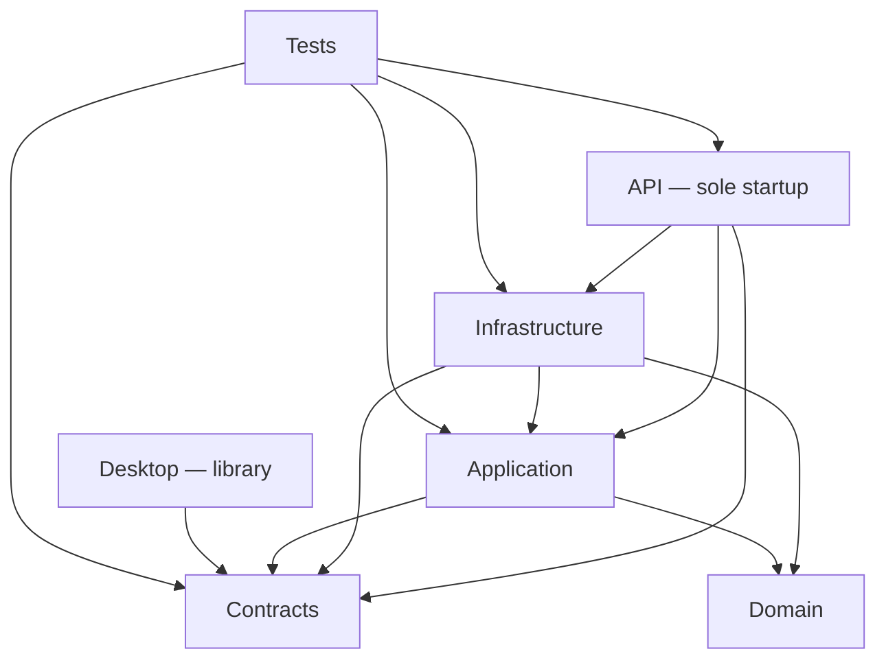

# TEAM-C1 Dependency Mapping

**Version:** `1.1 — CORRECTED REOPEN PACKAGE`

**Scope:** Reissued unchanged in substance from v1.0; included to provide a complete self-contained v1.1 package.

**Baseline:** `governance/control-tower-20260828` @ `8a36f88b56a43cd5b47277b645ba2030ed3da4f1`

## Direct project references

| From | Directly references |
|---|---|
| Domain | — |
| Contracts | — |
| Application | Domain, Contracts |
| Infrastructure | Domain, Application, Contracts |
| API | Application, Contracts, Infrastructure |
| Desktop | Contracts |
| Mobile.Admin | — |
| Mobile.Customer | — |
| Mobile.Driver | — |
| Tests | Application, Contracts, Infrastructure, API |

## Directed dependency map

The three Mobile projects are isolated nodes with no project references. The graph is acyclic: **no circular project dependency is present**.

## Runtime composition path

1. `TransportERP.Api/Program.cs` creates the only current host.
2. API registers `TransportErpDbContext`, `AuditEventService`, `SyncOperationService`, and the Waybill modules.
3. Waybill modules register Application services against Infrastructure implementations.
4. Infrastructure implements Application/Contract ports and uses Domain rules/entities plus EF/Npgsql.
5. Desktop cannot reach Application/Infrastructure/API through project references and contains no alternative client adapter.
6. Mobile projects contain no runtime source.

## Principal dependency observations

| Observation | Evidence-bound conclusion |
|---|---|
| API → Infrastructure direct reference | Required by current composition because API names persistence types directly |
| Infrastructure → Application | Infrastructure implements application ports; direction is inward-to-port but the physical library reference is Infrastructure-to-Application |
| API direct EF/Npgsql packages | Provider/package ownership overlaps Infrastructure; API source does not prove provider-specific behavior beyond composition imports |
| Tests → API plus lower layers | One broad test assembly spans unit, contract, API, and PostgreSQL integration concerns |
| Desktop → Contracts only | Forms are DTO/event surfaces, not a connected client |
| Mobile isolation | No shared/kernel/application/offline dependency exists at this ref |

## Circularity

- Project-reference cycles: **NONE PROVEN**.
- Namespace/type-level runtime cycles: **NONE PROVEN** from static repository references.
- Database foreign-key cycles were not used as software dependency cycles and are outside this conclusion.

## Tight coupling proved by code

- API directly constructs its runtime by concrete Infrastructure types.
- All persistent capabilities share one DbContext and one Infrastructure namespace/folder.
- `EfShippingExecutionStore` combines nine workflow families, EF transactions, idempotency outcomes, audit emission, mapping, and error handling in one 1,212-line class.
- Desktop forms use specific Contract DTOs and event arguments but have no client/application abstraction that connects those events.
- Tests share a single assembly across web host, persistence, contracts, domain/application behavior, and PostgreSQL fixtures.
