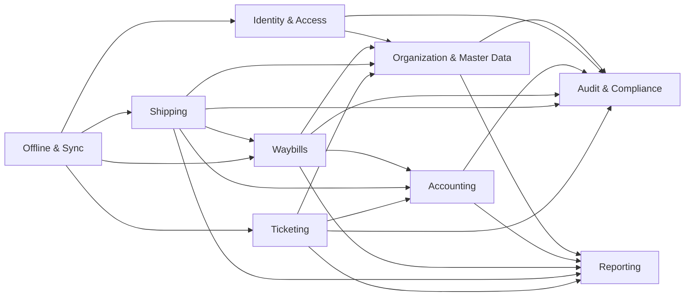
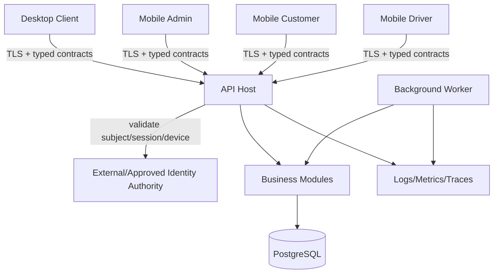
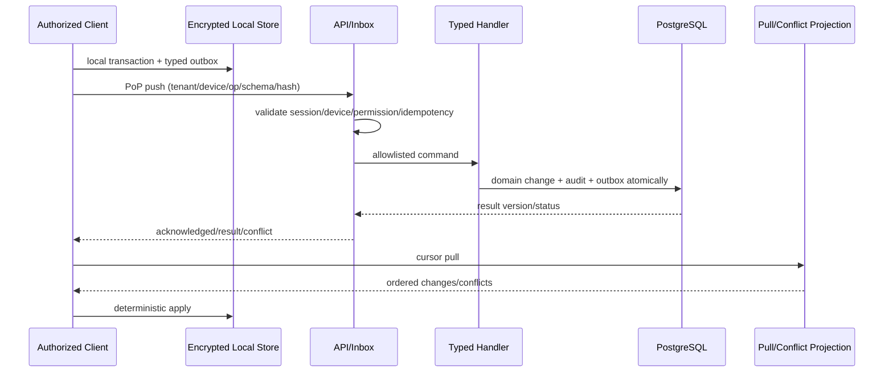

# TEAM-C2 Target Architecture Maps

All diagrams are `PROPOSED — NOT IMPLEMENTED`. They express target responsibilities, not current runtime.

## 1. Context map



Arrows indicate contract/event consumption, not direct entity/table access.

## 2. Runtime/container map



The IdP/device/Production details remain unknown. The map is conditional on approved evidence and configuration.

## 3. Request security flow

```text
Token/PoP proof
  -> issuer/session validation
  -> server lookup of user + company + branch + device status
  -> TenantContext construction
  -> permission/SoD decision
  -> module command/query
  -> tenant-consistent persistence guard
  -> atomic audit/outbox
  -> redacted response
```

Independent claims are not accepted as a substitute for server-side membership and device validation.

## 4. Accounting posting flow

```text
Approved source document
  -> validate actor/tenant/branch/period/currency/idempotency
  -> resolve governed posting rule
  -> create balanced Journal + Lines
  -> link source document
  -> mark POSTED
  -> append canonical Audit + Outbox
  -> commit one transaction
```

If any step fails, no `POSTED` state may survive. Reversal creates linked inverse evidence; it never rewrites posted history.

## 5. Offline flow



This flow is disabled for business writes until the governing offline authority permits each operation.

## 6. Data ownership map

| Owner | Writes | May read via | Forbidden shortcut |
|---|---|---|---|
| Organization | companies, branches, master data | owned repository/contracts | other modules mutating master tables |
| IdentityAccess | users, roles, permissions, sessions, devices | authorization service | claim-only tenant/device trust |
| Accounting | vouchers, journals, periods, ledger links | posting/query contracts | operational module writing journal tables |
| Waybills | waybill aggregate/items/parties | owned commands/queries | shipping rewriting item meanings/Volume |
| Shipping | trip/custody/allocation/manifest/movement | Waybill reference/contracts | direct Waybill persistence mutation |
| Ticketing | booking/seat/passenger/trip-ticket state | approved master/accounting contracts | reuse of shipping tables by name similarity |
| OfflineSync | inbox/outbox/sync/conflict/cursors | typed module handlers | generic arbitrary entity/payload execution |
| AuditCompliance | canonical append-only events/policies | controlled query/export | business code mutating historical events |
| Reporting | projections only | events/read contracts | operational writes or bypassed authorization |

## 7. Migration coexistence map

```text
Existing single DbContext + migration lineage
  -> inventory and lock baseline
  -> introduce logical module mappings without table movement
  -> verify fresh/upgrade/drift/restore parity
  -> optionally introduce module DbContexts against unchanged ownership
  -> forward-only schema ownership transitions
  -> retire legacy mapping only after dual-read/parity evidence
```

No step is authorized by this diagram; all database steps are governed by DB-GOV-001.
